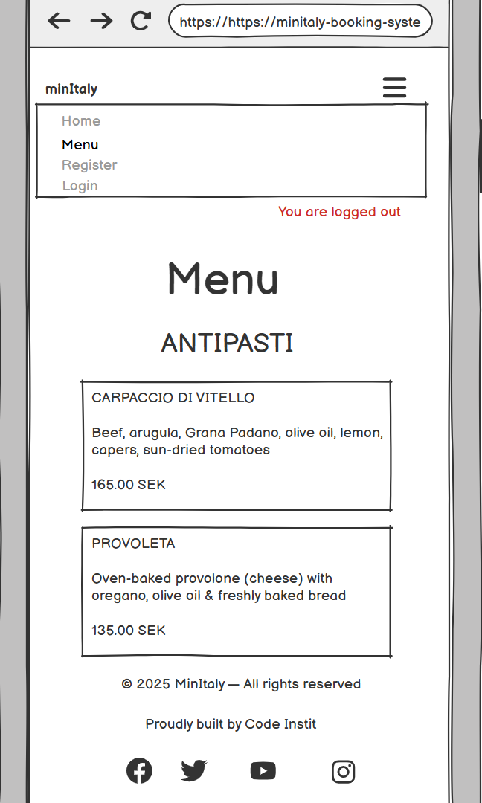
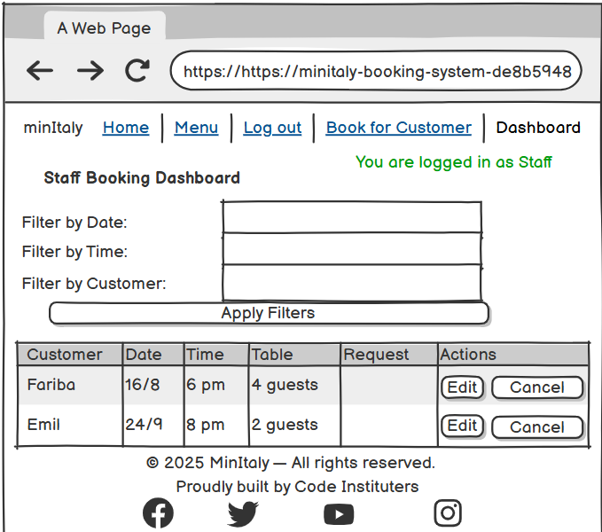
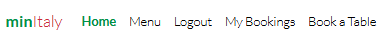
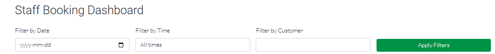

# minItaly Booking System


Welcome to Minitaly, a stylish and intuitive restaurant booking platform built with Django. Designed to offer a smooth experience for both customers and staff, it allows users to book, manage, and cancel reservations while providing staff with administrative tools and a real-time dashboard.

Visit the deployed site: [minItaly](https://minitaly-booking-system-de8b5948572a.herokuapp.com/)


## CONTENTS

* [Introduction](#introduction)
* [Strategy Plane](#strategy-plane)
    * [Project Goals](#project-goals)
* [Scope Plane](#Scope-plans)
    * [Feature Planning](#feature-planning)
* [Future Scope](#future-scope)
* [Structure Plane](#structure-plane)
    * [User Stories](#user-stories)
    * [Database Schema](#database-chema)
* [Skeleton Plane](#skeleton-plane)
    * [Wireframes](#wireframes)
* [Surface Plane](#surface-plane)
    * [Colour Scheme](#colour-scheme)
    * [Typography](#typography)
    * [Imagery](#imagery)
* [Features](#features)
* [Accessibility](#accessibility)
* [Technologies Used](#technologies-used)
    * [Languages](#languages)
    * [Frameworks & Libraries](#frameworks--libraries)
    * [Backend, Deployment & Hosting](#backend-deployment--hosting)
    * [Development Tools](#development-tools)
    * [Design & Assets](#design--assets)
    * [Validation & Testing Tools](#validation--testing-tools)
* [Deployment & Local Development](#deployment--local-development)
  * [Deployment](#deployment)
  * [Local Development](#local-development)
  * [How to Fork](#how-to-fork)
  * [How to Clone](#how-to-clone)
    * [Background Tasks & Reminder Emails](#background-tasks--reminder-emails)
* [Testing](#testing)
  * [Solved Bugs](#solved-bugs)
* [Credits & Acknowledgments](#credits--acknowledgments)

- - -

## Introduction


## Strategy Plane

The aim of Minitaly is to deliver a polished and responsive restaurant booking system that caters to the needs of four distinct user groups: non-member guests, registered customers, staff members, and admin/superusers.

### Project Goals

* Non-Member Guests
    * Access a responsive, visually appealing landing page that reflects the brand identity.
    * View the restaurant's digital menu to explore offerings before booking.
    * Register for an account in order to make and manage reservations.

* Registered Customers
    * Book a table online based on date, time, and number of guests.
    * Receive confirmation and reminder emails for reservations.
    * View and manage upcoming and past bookings through a personalized dashboard.
    * Edit or cancel reservations with ease.
    * Opt-in for email reminders about upcoming reservations.

* Staff Members
    * Access a dedicated staff dashboard with all upcoming bookings.
    * Filter bookings by date, time, or customer name.
    * Edit or cancel any customer booking.
    * Create new bookings on behalf of any registered customer.
    * Oversee booking logic, time slot availability, and table capacity.

* Admins/Superusers
    * Have full control over all models via the Django admin panel.
    * Access all customer and booking data.
    * Manage menu items and categories.
    * Bypass booking rules if needed (for testing, debugging, or data correction purposes).

* Business Objectives
    * Streamline the booking process to reduce phone calls and human error.
    * Empower both staff and customers with self-service features.
    * Enhance customer satisfaction with timely communication and a seamless UX.
    * Showcase the restaurant brand through design, accessibility, and responsiveness.


## Scope Plane

### Feature Planning

* Core Features

    * For Non-Member Guests
        * View the landing page with restaurant branding.
        * Browse the structured digital menu by category.
        * Access sign-up and login links to create an account.
    
    * For Registered Customers
        * Book a table
        * View upcoming and past reservations, edit, and cancel bookings via a user-friendly dashboard.
        * Automatically receive booking confirmation and cancellation emails.
        * Receive reminder emails 24 hours before a reservation (if opted in).
        * Form validations to prevent bookings in the past or overlapping time slots.
    
    * For Staff Members
        * Access a secure staff dashboard restricted to staff users.
        * View all upcoming reservations with filters by date, time, and customer.
        * Create new bookings, and edit and cancel any bookings on behalf of customers.
    
    * For Admins/Superusers
        * Access Django admin panel to manage users, bookings, menu items, and categories.
        * Ability to override validations via the admin interface (if needed for manual corrections).

## Future Scope
Several features were considered during the planning phase but were excluded due to project scope and time constraints. These may be included in future iterations:

* Intelligent Table Assignment
    * Automatically assign tables based on party size and availability.
    * Allow table sharing for small parties at larger tables.
    * Prioritize optimal space usage (e.g., placing 4 guests at a 4-person table when possible).
* Table Occupancy Tracking
    * Allow staff to manually mark tables as "occupied."
    * Prevent bookings for tables currently marked as occupied. The system already prevents double bookings per time slot, but future enhancements may allow marking individual tables as "occupied" for real-time floor management.
    * Automatically update a table’s status when a booking begins.
* Additional Ideas
    * Integrate Google Calendar or other APIs for reservation syncing.
    * Add online payment and deposit functionality for reservations.
    * Allow customers to mark favorite menu items or leave feedback.
    * QR code scanning for menu at table.
    

## Structure Plane
The project follows an Agile methodology with clearly defined user stories tailored to different user roles. Each user story includes a goal and acceptance criteria to guide implementation.
To ensure a focused and deliverable MVP, user stories were prioritized using the MoSCoW method:
* Must Have – Core functionality that is critical for the app to function (e.g., booking, editing, user authentication).
* Should Have – Important features that enhance usability but are not vital for launch (e.g., reminder emails, booking history).
* Could Have – Nice-to-have features that add polish or optional convenience (e.g., styled modals, visual enhancements).
* Won’t Have (for now) – Future features out of scope due to time constraints (e.g., smart table assignment). 

### User Stories

1. As a Guest I want to view the restaurant’s landing page, so I can learn about the brand and its offerings. (Must)

2. As a guest, I want to register an account, so that I can make and manage bookings online. (Must)
    * Acceptance criteria 1: A user can sign up with an email and password. (Must)
    * Acceptance criteria 2: The system prevents duplicate accounts using the same email. (Must)
    * Acceptance criteria 3: After successful registration, the user is redirected to the login page. (Must)

3. As a registered customer or admin, I want to log in securely, so that I can access my profile and manage bookings. (Must)
    * Acceptance criteria 1: Users must enter a valid email and password. (Must)
    * Acceptance criteria 2: Passwords are securely stored and validated. (Must)
    * Acceptance criteria 3: Users are redirected to the dashboard upon successful login. (Must)
    * Acceptance criteria 4: Incorrect login attempts show an error message. (Must)

4. As a registered customer, I want to book a table, so that I can secure a spot at the restaurant. (Must)
    * Acceptance criteria 1: The booking form allows users to select a date, time, and number of guests. (Must)
    * Acceptance criteria 2: The system prevents double bookings for the same table. (Must)
    * Acceptance criteria 3: Users receive a confirmation email upon successful booking. (Must)
    * Acceptance criteria 4: The system does not allow past dates for reservations. (Must)

5. As a guest or customer, I want to see available booking slots, so that I can plan when to visit. (Must)
    * Acceptance criteria 1: The system displays available time slots for a selected date. (Must)
    * Acceptance criteria 2: Fully booked time slots are marked as unavailable. (Must)
    * Acceptance criteria 3: Users cannot book beyond the restaurant’s operating hours. (Must)

6. As a system, I want to prevent double bookings, so that each table is assigned only once per time slot. (Must)
    * Acceptance criteria 1: The system checks table availability before confirming a booking. (Must)
    * Acceptance criteria 2: A booking is only confirmed if a table is available. (Must)
    * Acceptance criteria 3: Users cannot book the same table at the same time. (Must)

7. As a registered customer or admin, I want to cancel a booking, so that the table becomes available for others. (Must)
    * Acceptance criteria 1: Users can cancel a booking from their dashboard. (Must)
    * Acceptance criteria 2: Admins can cancel any booking and provide a reason. (Must)
    * Acceptance criteria 3: Users receive an email confirming the cancellation. (Must)

8. As a registered customer, I want to update my booking (change time, number of guests), so that I can modify my reservation as needed. (Must)
    * Acceptance criteria 1: Users can change their booking details (date, time, number of guests). (Must)
    * Acceptance criteria 2: The system checks table availability before confirming changes. (Must)
    * Acceptance criteria 3: Users receive an email with the updated booking details. (Must)

9. As a restaurant admin, I want to view all upcoming bookings, so that I can prepare for reservations. (Must)
    * Acceptance criteria 1: Admins can see all upcoming bookings in a list format. (Must)
    * Acceptance criteria 2: Bookings can be filtered by date, time, and customer name. (Must)
    * Acceptance criteria 3: Admins can cancel or modify bookings from the dashboard. (Must)

10. As a registered customer, I want to see my booking history, so that I can keep track of past visits. (Should)
    * Acceptance criteria 1: Users can view a list of all past bookings. (Should)
    * Acceptance criteria 2: The history includes date, time, and number of guests. (Should)
    * Acceptance criteria 3: Users can see cancellations with reasons. (Should)

11. As a guest, I want to view the restaurant's menu, so that I can decide what to order. (Must)
    * Acceptance criteria 1: The menu is displayed in a structured format (categories, prices, descriptions). (Must)
    * Acceptance criteria 3: The menu is responsive and accessible on all devices. (Must)

12. As a registered customer, I want to receive a reminder email before my reservation, so that I don’t forget my booking. (Could)
    * Acceptance criteria 1: The system sends an email reminder 24 hours before the booking. (Could)
    * Acceptance criteria 2: The email contains booking details (date, time, table number). (Could)
    * Acceptance criteria 3: Users can opt out of reminders in their settings. (Could)

13. As a restaurant admin, I want to create a booking on behalf of a customer, so that I can assist with offline or phone reservations. (Should)
    * Acceptance criteria 1: Admins can choose an existing registered customer from a dropdown list when creating a booking. (Should)
    * Acceptance criteria 2: The rest of the booking form (date, time, number of guests, special requests) behaves the same as the customer form with validations for availability. (Should)
    * Acceptance criteria 3: Upon submission, the booking is saved under the selected customer's account. (Should)
    * Acceptance criteria 4: A booking confirmation email is sent to the selected customer. (Should)
    * Acceptance criteria 5: Admins are redirected to the staff dashboard with a success message confirming the booking. (Should)

14. As a system, I want to assign tables automatically, so that the space is utilized efficiently. (Won’t)
    * Acceptance criteria 1: he system assigns tables based on party size. (Won’t)
    * Acceptance criteria 2: Multiple small parties can share a larger table if needed. (Won’t)
    * Acceptance criteria 3: The system prioritizes optimal table use (e.g., seating 4 people at a 4-person table instead of a 6-person table). (Won’t)

15. As a restaurant admin, I want to mark a table as occupied, so that the system knows which tables are in use. (Won’t)
    * Acceptance criteria 1: Admins can manually mark tables as occupied. (Won’t)
    * Acceptance criteria 2: Tables marked as occupied do not appear as available in the system. (Won’t)
    * Acceptance criteria 3: The system automatically marks a table as occupied when a booking starts. (Won’t)

### Database Schema

The data schema for the Minitaly booking system has been designed to support the key features of the application, including user authentication, reservation logic, staff controls, and menu display. It uses relational database models with appropriate foreign key and many-to-many relationships to maintain data integrity and allow efficient queries.

Below are the Entity Relationship Diagrams (ERDs) represented in table format, outlining the structure and relationships between all models used in the project:

* Table
    | Field | Type | Attributes |
    | --- | --- | --- |
    | id | AutoField | Primary Key |
    | number | PositiveIntegerField | Unique |
    | capacity | PositiveIntegerField |  |

* Booking
    | Field | Type | Attributes |
    | --- | --- | --- |
    | id | AutoField | Primary Key |
    | user | ForeignKey to User | on_delete=CASCADE, related_name='bookings' |
    | tables | ManyToManyField to Table |  |
    | date | DateField |  |
    | time | TimeField |  |
    | num_guests | PositiveIntegerField |  |
    | special_request | TextField | blank=True, null=True |
    | is_cancelled | BooleanField | default=False |
    | cancellation_reason | TextField | blank=True, null=True |
    | send_reminder | BooleanField | default=True |
    | reminder_sent | BooleanField | default=False |

* Category (Menu)
    | Field | Type | Attributes |
    | --- | --- | --- |
    | id | AutoField | Primary Key |
    | name | CharField(100) |  |

* MenuItem
    | Field | Type | Attributes |
    | --- | --- | --- |
    | id | AutoField | Primary Key |
    | category | ForeignKey to Category | on_delete=CASCADE, related_name='menu_items' |
    | name | CharField(100) |  |
    | description | TextField | blank=True |
    | price | DecimalField | max_digits=6, decimal_places=2 |

* User: The User model is predefined by Django as part of django.contrib.auth.models.User
    | Field | Type | Attributes |
    | --- | --- | --- |
    | id |	AutoField |	Primary key |
    | username | CharField | Unique username |
    | email | EmailField | Email address |
    | password | CharField | Hashed password |
    | first_name | CharField | Optional first name |
    | last_name | CharField | Optional last name |
    | is_staff | BooleanField | True if the user can access admin site |
    | is_superuser | BooleanField | True if the user has all permissions |
    | is_active | BooleanField | Active user flag |
    | last_login | DateTimeField | Last login timestamp |
    | date_joined |	DateTimeField |	Account creation timestamp |

A User (from Django's built-in model) can have many Booking entries; One-to-many relationship.
A Booking can be associated with one or more Table objects, and a Table can belong to many Booking entries; many-to-many relationship.
A Category can have many MenuItem entries, and a MenuItem belongs to one Category; one-to-many relationship.


## Skeleton Plane


### Wireframes

| Page | Mobile Wireframes |
| --- | --- |
| Home page |  |
| Menu |  |
| Register |  |
| Login |  |
| My Bookings |  |
| Book a Table |  |
| Book for Customer |  |
| Dashboard (staff/admin only) |  |
| Logout |  |

| Page | Desktop Wireframes |
| --- | --- |
| Home page |  |
| Menu |  |
| Register |  |
| Login |  |
| My Bookings |  |
| Book a Table |  |
| Book for Customer |  |
| Dashboard (staff/admin only) |  |
| Logout |  |


## Surface Plane

The Surface Plane focuses on the visual and sensory design of the website — what users see, feel, and interact with. It includes the choice of colors, typography, layout, and imagery, all working together to reflect the brand identity of Minitaly and create a seamless and pleasant user experience.

The following sections outline the Color Scheme, Typography, and Imagery used throughout the project, ensuring consistency, accessibility, and aesthetic appeal across all devices and screen sizes.


### Colour Scheme

Minitaly uses a color palette inspired by the Italian flag and cuisine culture to reflect the brand identity and warmth of an Italian dining experience. The scheme includes vibrant greens and reds paired with clean whites and elegant grays for accessibility and clarity.


| Color Role | Hex Code | Usage |
| --- | --- | --- |
| Italian Green | #009246 | Primary accent color for branding, buttons, links, active nav items, checkboxes |
| Italian Red | #CE2B37 | Used for branding, cancel buttons, menu card borders |
| Soft Red Hover | #f07f9d | Used for cancel buttons |
| Soft Green Hover | #afeecd | Used for edit and submit buttons |
| Light Green Tint | #e6f4ec | Accordion active background |
| Black | #000000 | Default text, nav links, social icons |
| White | #ffffff | Backgrounds, button label texts, base layout |


### Typography

* Headings & Emphasis Text:

    Roboto, imported from Google Fonts, is used for all headings (h1–h6), .display-4 elements, and paragraph text to create a bold and modern tone.

* Body Text:

    Lato, also imported from Google Fonts, is used as the base font for the body, providing a clean and readable style that contrasts subtly with the headings.

Both fonts are sans-serif and ensure a cohesive and elegant look across all devices.


### Imagery

To set the mood and style for visitors, reinforcing the Minitaly brand through visual storytelling, the project uses a single, carefully selected hero image on the landing page to immediately convey the essence of the restaurant. Image taken from this [Source](https://www.tastingtable.com/img/gallery/20-italian-dishes-you-need-to-try-at-least-once/l-intro-1643403830.jpg)

Description: A vibrant and inviting photograph of authentic Italian cuisine, showcasing rich colors like Italian green and Italian red—perfectly aligned with the brand’s color scheme.

The image is hosted locally in the static files and styled to appear full-width with a semi-transparent overlay and centered text.

To optimize the image for the website and improve loading times for users, I used [Image Resizer.com](https://imageresizer.com/) to resize and compress the image.


## Features

1. Landing Page with Hero Section
    * Visually engaging hero image.
    * Welcome message and CTA button ("Book a Table").
    
    
    
    

2. Responsive Navigation Bar with Role-Based Links
    * Dynamic links based on authentication and user role.
    * Brand logo styled with Italian flag colors.
    * Staff and customers see different navigation items dynamically.

    
    
    
    
    

3. User Registration (Sign Up)
    * Create an account via Django Allauth.
    * Email and password fields with secure validation.
    * Custom styling to align with the restaurant branding.
    * Email verification disabled for fast testing during development.
    
    
    
    
    
    
    
    

4. User Authentication (Login)
    * Log in securely with email and password.
    * Error messages for incorrect credentials.
    * "Remember Me" checkbox with custom green tick styling.
    
    
    
    

5. Log Out Functionality
    * Secure logout route.
    * Session cleared on sign out.
    * Clean redirect
    * Django styling confirmation message removed for clarity.
    
    
    

6. Book a Table (Customer)
    * Customers can book tables for specific date, time, and guest count.
    * Real-time availability based on party size and existing bookings.
    * Confirmation email sent after successful booking.
    
    
    
    
    
    

7. Edit Booking
    * Customers can edit date, time, number of guests, or special request.
    * Booking availability checks again before saving.
    * Updated booking confirmation message displayed.
    
    
    
    

8. Cancel Booking
    * Customers can cancel upcoming bookings via a confirmation modal.
    * Cancellations remove the booking from availability.
    
    
    
    
    

9. Success confirmation messages for booking actions
    * Users and staff receive clear success messages after creating, editing, or cancelling a booking. Enhances user experience by confirming that their action was successful.
    

10. My Bookings; Customer Dashboard 
    * View upcoming bookings and booking history in two collapsible accordion sections
    * Edit or cancel upcoming reservations.
    * Responsive accordion-style UI for easy toggling.
    
    
    

11. Staff Dashboard
    * Staff can view all upcoming bookings in a table layout.
    * Filter bookings by date, time, or customer name.
    * Edit or cancel any booking on behalf of customers.
    * Cancellation includes providing a reason and sending a confirmation email.
    
    
    
    
    

12. Create Booking on Behalf of Customer (Staff Only)
    * Staff can select a customer from a dropdown.
    * Booking behaves the same as customer booking form.
    * Confirmation success message to staff and confirmation email sent to selected customer.
    
    
    
    
    
    
    

13. Defensive Design with Confirmation Modals
    * Booking cancellations require user confirmation via Bootstrap modal.
    * Customers confirm before canceling their own reservations.
    * Staff confirm and provide cancellation reasons before canceling bookings.
    
    
    
    

14. Menu Display Page
    * Fully structured menu with categories, prices, and descriptions.
    * Responsive card layout styled with Bootstrap.
    
    
    
    

15. Email Notifications
    * Confirmation email sent after successful booking.
    * Cancellation email sent when a reservation is cancelled.
    * Optional booking reminder 24 hours before reservation (if enabled).
        * **Automated Reminder Emails**
            - Customers who opt-in receive an email reminder 24 hours before their reservation.
            - Handled via `django-cron` in development.
            - Note: Due to Heroku's free tier limitations, background tasks aren't scheduled automatically in production.
            - Manual command required: `python manage.py runcrons`
            - For full automation, an external scheduler (like Heroku Scheduler) is needed (not included in this version).


16. Custom Styling with Bootstrap and CSS inspired by the Italian flag colors (green, white, red).

17. Mobile-First & Responsive Design
    * All views optimized for mobile, tablet, and desktop.
    * Buttons, modals, and tables adjust layout for all screen sizes.

## Accessibility

MinItaly was built with accessibility in mind to ensure an inclusive and user-friendly experience for all users. Key accessibility considerations include:

* Responsive Design: Fully responsive across mobile, tablet, and desktop devices using Bootstrap 5.

* High Color Contrast: Key elements such as buttons, alerts, and links meet WCAG color contrast standards for visibility.

* Keyboard Navigability: All interactive elements (buttons, links, forms) are navigable using keyboard input.

* Semantic HTML: Use of semantic HTML elements such as `<nav>`, `<main>`, `<footer>`, and proper heading structure for improved screen reader compatibility.

* ARIA and Labeling: All form fields are clearly labeled and use appropriate placeholder text and `<label>` tags.

* Focus States: Form controls and navigation links have clear focus states for users navigating via keyboard or screen readers.

* Alt Text: All images (including favicon and hero image) use alt attributes or are decorative when appropriate.

* Error Handling: User feedback is provided through clearly styled success and error messages.

These steps aim to create a smooth experience for all users, including those using assistive technologies.


## Technologies Used

### Languages

- **HTML5**
- **CSS3**
- **JavaScript**
- **Python 3**


### Frameworks & Libraries

- **[Django](https://www.djangoproject.com/)** – Backend web framework
- **[Bootstrap 5](https://getbootstrap.com/)** – Front-end CSS framework for responsive UI
- **[Django Allauth](https://django-allauth.readthedocs.io/)** – User registration and authentication
- **[Font Awesome](https://fontawesome.com/)** – Icons
- **[Google Fonts](https://fonts.google.com/)** – Typography (Roboto and Lato)


### Backend, Deployment & Hosting

- **[Gunicorn](https://gunicorn.org/)** – WSGI server for deploying Django apps
- **[Whitenoise](https://whitenoise.readthedocs.io/)** – Static file serving in production
- **[PostgreSQL](https://www.postgresql.org/)** – Production database
- **[dj-database-url](https://pypi.org/project/dj-database-url/)** – Parses database URLs for Django
- **[python-dotenv](https://pypi.org/project/python-dotenv/)** – Load environment variables
- **[Heroku](https://www.heroku.com/)** – Hosting platform


### Development Tools

- **[Git](https://git-scm.com/)** – Version control
- **[GitHub](https://github.com/)** – Code hosting and collaboration
- **[Gitpod](https://gitpod.io/)** / **VS Code** – IDEs used during development
- **[Chrome DevTools](https://developer.chrome.com/docs/devtools/)** – Inspect and debug frontend
- **[Balsamiq](https://balsamiq.com/)** – Wireframes


### Design & Assets

- **[Favicon Generator](https://realfavicongenerator.net/)** – Generate favicon icons
- **[Image Resizer](https://imageresizer.com/)** – Compress and resize images

### Validation & Testing Tools

- **[W3C Validator](https://validator.w3.org/)** – HTML validation
- **[Jigsaw CSS Validator](https://jigsaw.w3.org/css-validator/)** – CSS validation
- **[JSHint](https://jshint.com/)** – JavaScript linting
- **[Code Institute CI Python Linter](https://pep8ci.herokuapp.com/)**
- **[WAVE](https://wave.webaim.org/)** – Web accessibility evaluation
- **[Lighthouse](https://developers.google.com/web/tools/lighthouse/)** – Performance, accessibility, and SEO audits


## Deployment & Local Development

### Deployment

This project is deployed on [Heroku](https://dashboard.heroku.com/) using a PostgreSQL database provided by [Code Institute’s PostgreSQL service](https://dbs.ci-dbs.net/). Below are the steps taken to prepare and deploy the project.

* **Setup PostgreSQL Database**

1. Go to the PostgreSQL from Code Institute portal.

2. Enter your Code Institute student email and click Submit.

3. Wait until the database is created and check your email inbox for the database URL.

4. In your Django project, create a file called `env.py` at the root level.

5. Add the following inside `env.py`:
     ```
    python

    import os

    os.environ.setdefault("DATABASE_URL", "<your-db-url-here>") 
    ```
6. Add `env.py` to your `.gitignore` to keep it private:
    ```
    bash

    echo "env.py" >> .gitignore

    ```
* **Install PostgreSQL Requirements**

    In the terminal, install the required packages:

    ```
    bash

    pip3 install dj-database-url~=0.5 psycopg2~=2.9
    pip3 freeze > requirements.txt

    ```

    Update `settings.py`:

    ```
    python

    import os
    import dj_database_url

    if os.path.isfile('env.py'):
        import env

    DATABASES = {
        'default': dj_database_url.parse(os.environ.get("DATABASE_URL"))
    }

    ```
* **Migrate and Create Superuser**

    ```
    bash

    python3 manage.py migrate
    python3 manage.py createsuperuser

    ```

* **Secret Key and Email Config**

    In your `settings.py`, make sure your secret key and email credentials are loaded via environment variables:

    ```
    python

    SECRET_KEY = os.environ.get("SECRET_KEY")
    EMAIL_BACKEND = 'django.core.mail.backends.smtp.EmailBackend'
    EMAIL_HOST = 'smtp.gmail.com'
    EMAIL_PORT = 587
    EMAIL_USE_TLS = True
    EMAIL_HOST_USER = os.environ.get('EMAIL_HOST_USER')
    EMAIL_HOST_PASSWORD = os.environ.get('EMAIL_HOST_PASSWORD')
    DEFAULT_FROM_EMAIL = f"Minitaly <{EMAIL_HOST_USER}>"

    ```

    For security and portability, sensitive credentials should be stored in a `.env` file at the root of your project and never pushed to GitHub.

    Create a `.env` file in your project root (if it doesn't already exist):

    ```
    bash

    touch .env
    
    ```

    Add your secret credentials to `.env`:

    ```
    env

    DATABASE_URL=your-postgresql-db-url
    SECRET_KEY=your-django-secret-key
    EMAIL_HOST_USER=your-gmail-address
    EMAIL_HOST_PASSWORD=your-app-password
    
    ```

    Ensure `.env` is ignored by Git:

    Open `.gitignore` and make sure it includes the following line:

    ```
    gitignore

    .env
    
    ```
    This keeps your credentials secure and out of version control.

    Load environment variables in `settings.py`:

    Make sure you have the following in your `settings.py` to load the `.env` file:

    ```
    python

    from dotenv import load_dotenv

    load_dotenv()
    
    ```

    Add the following config vars in your Heroku dashboard:

    | Key | Value |
    |---|---|
    | DATABASE_URL       | Your PostgreSQL URL       |
    | SECRET_KEY         | Your Django secret key    |
    | EMAIL_HOST_USER    | Gmail email address       |
    | EMAIL_HOST_PASSWORD | Gmail App password       |

* **Final Heroku Setup**

1. In your terminal:

    ```
    bash

    pip3 install gunicorn
    pip3 freeze > requirements.txt

    ```
    
2. Add a `Procfile` to the root directory:

    ```
    Procfile

    web: gunicorn minitaly.wsgi:application

    ``` 
3. Run `collectstatic` to gather all static assets:

    ```
    bash

    python3 manage.py collectstatic

    ```
    
4. Set `DEBUG = False` in minitaly/settings.py, and update:

    ```
    python

    ALLOWED_HOSTS = ['localhost', '127.0.0.1', 'minitaly-booking-system-de8b5948572a.herokuapp.com']

    ```
    
5. Push changes to GitHub, then deploy from the Heroku dashboard.


### Local Development

To run the Minitaly project locally:

1. Clone the repository (see [How to Clone](#how-to-clone) section).

2. Install dependencies:

```
bash

pip install -r requirements.txt

```

3. Create an `env.py` file at the root of your project to store sensitive variables:

```
python

import os

os.environ.setdefault("DATABASE_URL", "<your-db-url>")
os.environ.setdefault("SECRET_KEY", "<your-secret-key>")
os.environ.setdefault("EMAIL_HOST_USER", "<your-gmail>")
os.environ.setdefault("EMAIL_HOST_PASSWORD", "<your-app-password>")

```

4. Ensure `env.py` is added to `.gitignore` to keep your credentials safe.

5. Apply migrations:

```
bash

python manage.py migrate

```

6. Create a superuser:

```
bash

python manage.py createsuperuser

```

7. Start the development server:

```
bash

python manage.py runserver

```


### How to Fork

To create your own copy of this repository:

1. Log in to [GitHub](https://github.com/).

2. Navigate to the [Minitaly Repository](https://github.com/Fariba-Kamani/minitaly-booking-system).

3. Click the Fork button at the top-right corner.

4. This creates a copy under your own GitHub account.


### How to Clone

To clone the repository to your local machine:

1. On your forked repo, click the green Code button.

2. Copy the URL under HTTPS.

3. Open your terminal and navigate to the directory where you want the project.

4. Run the following command:

```
bash

git clone https://github.com/<your-username>/minitaly-booking-system.git

```

5. Change into the project directory:

```
bash

cd minitaly-booking-system

```

#### Background Tasks & Reminder Emails

Reminder emails are managed by `django-cron`. Due to limitations of Heroku’s free tier (which doesn’t support persistent background tasks), reminders are **not sent automatically**.

To send them in production:

- Run manually:

  ```
  bash

  python manage.py runcrons

  ```

- Or use a third-party service like Heroku Scheduler (this may require a paid plan).

This limitation is clearly explained in the README under the Deployment and Features sections.

## Testing

Please refer to [TESTING.md](TESTING.md) file for all testing carried out.

### Solved Bugs

Throughout development, several bugs were identified and resolved to ensure a smooth user experience. Key fixes included: improving role-based logic in the navigation bar (e.g., hiding customer-only links from staff users), excluding cancelled bookings from staff views, and resolving booking edit issues caused by inconsistent date/time formatting between JavaScript and Django. Time and date inputs were normalized to avoid validation errors on unchanged form submissions. All fixes were tracked via commits and thoroughly tested after resolution.

## Credits & Acknowledgments

Code Institute – For providing the Full-Stack curriculum, project structure, and valuable support throughout the course.

[Code Institute’s "I Think Therefore I Blog" Walkthrough Project](https://learn.codeinstitute.net/courses/course-v1:CodeInstitute+FSD101_WTS+7/courseware/713441aba05441dfb3a7cf04f3268b3f/824fccecd0fe4e44871eeabcbf69d830/) – Used as a learning reference throughout development. Helped structure Django views, templates, forms, and implement Bootstrap-based styling and layout patterns effectively.

My Mentor – For feedback, encouragement, and help during development.

ChatGPT (by OpenAI) – For providing guidance, and help with debugging and documentation during the project.

Open-source Communities – For shared solutions, especially from Stack Overflow and the Django Discord/Forum.

Anyone who contributed inspiration, troubleshooting tips, or guidance during the project.


