# minItaly Booking System -  Testing


Visit the deployed site: [minItaly](https://minitaly-booking-system-de8b5948572a.herokuapp.com/)

This document outlines all testing performed for the Minitaly Booking System, including manual testing, validation of HTML, CSS, JavaScript, Python, accessibility checks, and a list of known bugs.

Due to a tight deadline, automated testing was not implemented.


## CONTENTS

* [AUTOMATED TESTING](#automated-testing)
  * [HTML Validation](#html-validation)
  * [CSS Validation](#css-validation)
  * [JavaScript Validation](#javascript-validation)
  * [Python Validation](#python-validation)
  * [Lighthouse](#lighthouse)
    * [Desktop Results](#desktop-results)
    * [Mobile Results](#mobile-results)
  * [Accessibility Testing](#accessibility-testing)
* [MANUAL TESTING](#manual-testing)
  * [Testing User Stories](#testing-user-stories)
  * [The Full Testing](#the-full-testing)
    * [Customer Features](#customer-features)
    * [Staff Features](#staff-features)
    * [Admin Features](#admin-features)
    * [Responsiveness](#responsiveness)
    * [Form Validation](#form-validation)
* [Known Bugs](#known-bugs)


- - -

## AUTOMATED TESTING
### HTML Validation

All HTML files were tested using the (W3C Markup Validation Service)[https://validator.w3.org/]. All validation errors have been resolved. No errors or warnings to show.

### CSS Validation

CSS was tested using (W3C CSS Validation Service)[https://jigsaw.w3.org/css-validator/]. No errors were found.

### JavaScript Validation

JavaScript code was checked using [JSHint](https://jshint.com/). No errors were detected. 
To silence warnings related to ES6 features and undefined global variables, I added the following comment at the top of my `booking_slots.js` file:

 ```
/* jshint esversion: 6 */
/* global initialTime, initialDate, initialGuests */
```
This explicitly tells JSHint to expect ES6 syntax and recognize the Django template-injected variables as global.


### Python Validation

Python code was validated using Code Institute's Python Linter.
All files followed PEP8 standards and passed linting with no significant issues.

### Lighthouse

Lighthouse performance, accessibility, and SEO checks were performed using Chrome DevTools.

#### Desktop Results

| Page | Result |
| --- | --- |
| Home page | 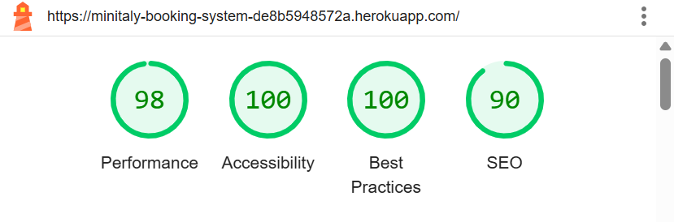 |
| Menu |  |
| Register | 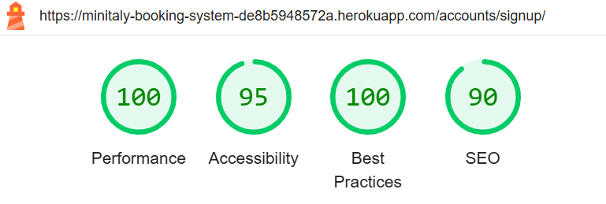 |
| Login | 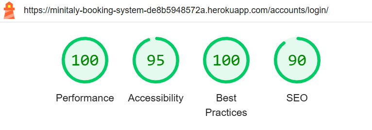 |
| My Bookings |  |
| Book a Table | 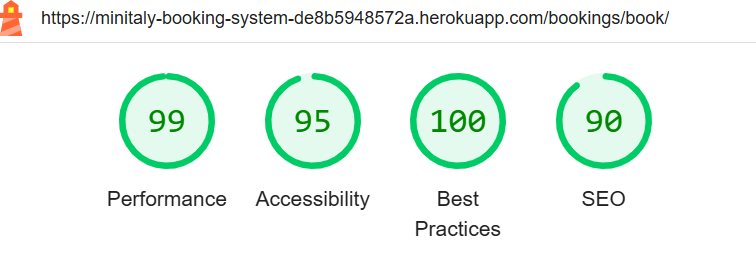 |
| Book for Customer | 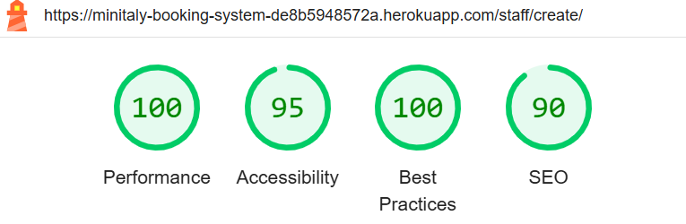 |
| Dashboard (staff/admin only) | 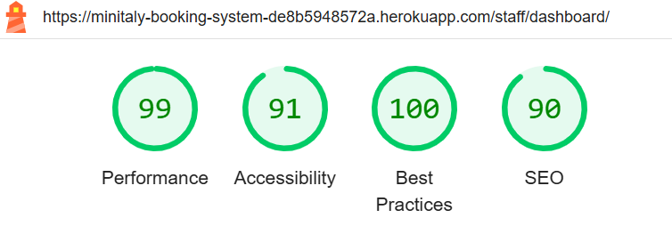 |
| Logout |  |

#### Mobile Results

| Page | Result |
| --- | --- |
| Home page | 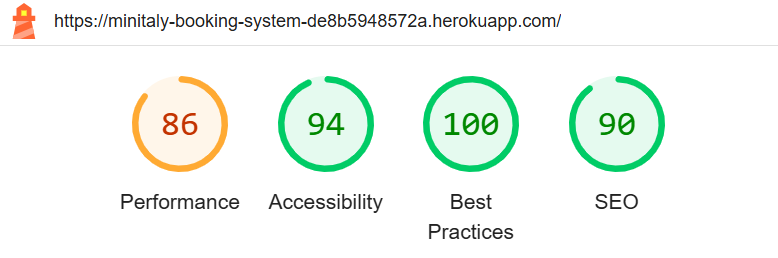 |
| Menu | 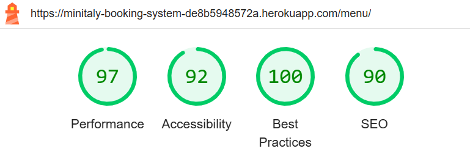 |
| Register | 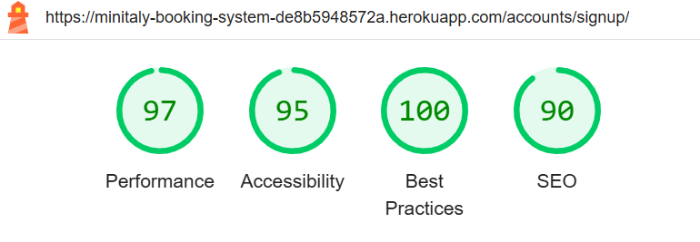 |
| Login | 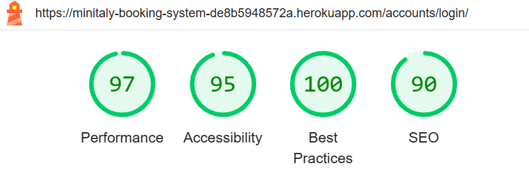 |
| My Bookings | 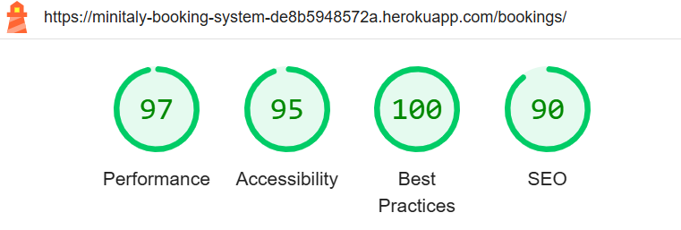 |
| Book a Table | 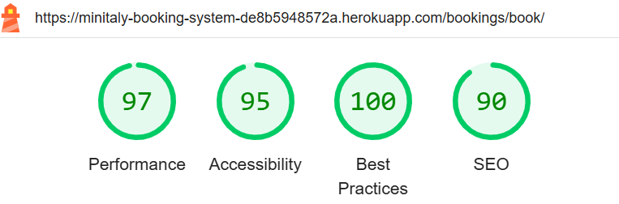 |
| Book for Customer | 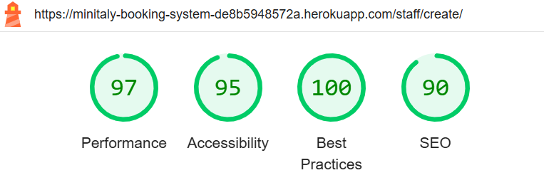 |
| Dashboard (staff/admin only) | 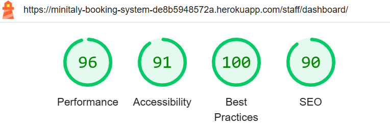 |
| Logout | 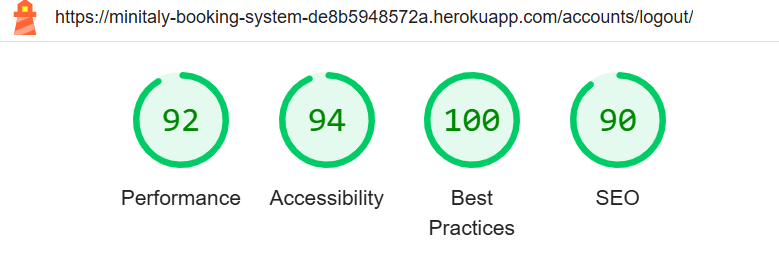 |

### Accessibility Testing

Accessibility testing was conducted using [WAVE Web Accessibility Evaluation Tool](https://wave.webaim.org/). All forms, labels, contrasts, and navigation structures were reviewed and improved where needed.

| Page | Result |
| --- | --- |
| Home page | 0 Errors, 0 Contrast Errors |
| Menu | 0 Errors, 0 Contrast Errors |
| Register | 0 Errors, 0 Contrast Errors |
| Login | 0 Errors, 0 Contrast Errors |
| Logout | 0 Errors, 0 Contrast Errors |

Some WAVE alerts (e.g., heading level skips or adjacent links) were deemed low priority for this version but noted for future refinement.
Unfortunately, it was not possible to test the URLs that require a logged-in customer or staff for accessibility via WAVE. These pages were manually reviewed using dev tools and semantic HTML structure was followed throughout. In future versions, ARIA roles and screen reader testing will be incorporated for improved accessibility.


## MANUAL TESTING
### Testing User Stories
### The Full Testing
#### Customer Features
#### Staff Features
#### Admin Features
#### Responsiveness
#### Form Validation
## Known Bugs