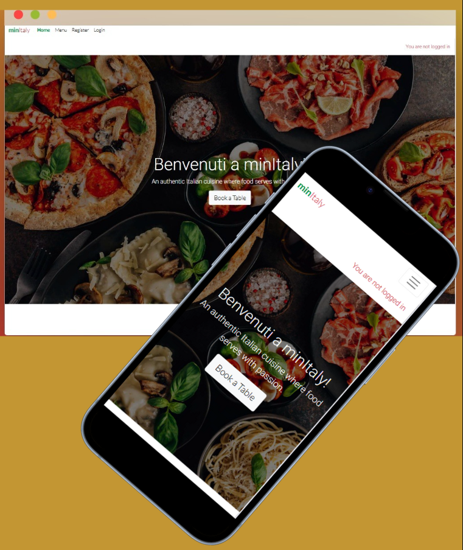
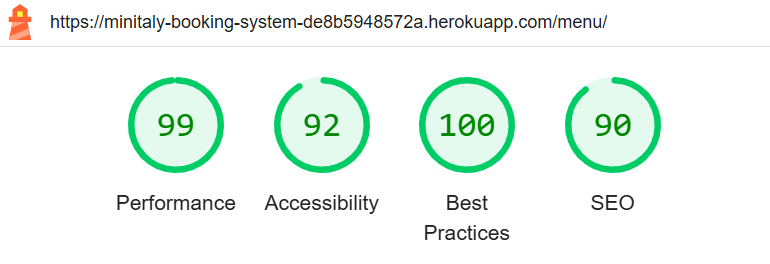
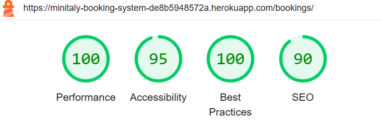

# minItaly Booking System -  Testing



Visit the deployed site: [minItaly](https://minitaly-booking-system-de8b5948572a.herokuapp.com/)

This document outlines all testing performed for the Minitaly Booking System, including manual testing, validation of HTML, CSS, JavaScript, Python, accessibility checks, and a list of known bugs.

Due to a tight deadline, automated testing was not implemented.


## CONTENTS

* [AUTOMATED TESTING](#automated-testing)
  * [HTML Validation](#html-validation)
  * [CSS Validation](#css-validation)
  * [JavaScript Validation](#javascript-validation)
  * [Python Validation](#python-validation)
  * [Lighthouse](#lighthouse)
    * [Desktop Results](#desktop-results)
    * [Mobile Results](#mobile-results)
  * [Accessibility Testing](#accessibility-testing)
* [MANUAL TESTING](#manual-testing)
  * [Testing User Stories](#testing-user-stories)
  * [The Full Testing](#the-full-testing)
* [Known Bugs](#known-bugs)


- - -

## AUTOMATED TESTING
### HTML Validation

All HTML files were tested using the (W3C Markup Validation Service)[https://validator.w3.org/]. All validation errors have been resolved. No errors or warnings to show.

### CSS Validation

CSS was tested using (W3C CSS Validation Service)[https://jigsaw.w3.org/css-validator/]. No errors were found.

### JavaScript Validation

JavaScript code was checked using [JSHint](https://jshint.com/). No errors were detected. 
To silence warnings related to ES6 features and undefined global variables, I added the following comment at the top of my `booking_slots.js` file:

 ```
/* jshint esversion: 6 */
/* global initialTime, initialDate, initialGuests */
```
This explicitly tells JSHint to expect ES6 syntax and recognize the Django template-injected variables as global.


### Python Validation

Python code was validated using [Code Institute's Python Linter](https://pep8ci.herokuapp.com/).
All files followed PEP8 standards and passed linting with no significant issues.

### Lighthouse

Lighthouse performance, accessibility, and SEO checks were performed using Chrome DevTools.

#### Desktop Results

| Page | Result |
| --- | --- |
| Home page |  |
| Menu |  |
| Register |  |
| Login |  |
| My Bookings |  |
| Book a Table |  |
| Book for Customer |  |
| Dashboard (staff/admin only) |  |
| Logout |  |

#### Mobile Results

| Page | Result |
| --- | --- |
| Home page |  |
| Menu |  |
| Register |  |
| Login |  |
| My Bookings |  |
| Book a Table |  |
| Book for Customer |  |
| Dashboard (staff/admin only) |  |
| Logout |  |

### Accessibility Testing

Accessibility testing was conducted using [WAVE Web Accessibility Evaluation Tool](https://wave.webaim.org/). All forms, labels, contrasts, and navigation structures were reviewed and improved where needed.

| Page | Result |
| --- | --- |
| Home page | 0 Errors, 0 Contrast Errors |
| Menu | 0 Errors, 0 Contrast Errors |
| Register | 0 Errors, 0 Contrast Errors |
| Login | 0 Errors, 0 Contrast Errors |
| Logout | 0 Errors, 0 Contrast Errors |

Some WAVE alerts (e.g., heading level skips or adjacent links) were deemed low priority for this version but noted for future refinement.
Unfortunately, it was not possible to test the URLs that require a logged-in customer or staff for accessibility via WAVE. These pages were manually reviewed using dev tools and semantic HTML structure was followed throughout. In future versions, ARIA roles and screen reader testing will be incorporated for improved accessibility.


## MANUAL TESTING
### Testing User Stories

All implemented user stories were tested manually to ensure they meet their respective acceptance criteria. This included features such as user authentication, table booking, booking management (create, edit, cancel), role-based access control for staff and customers, and dynamic UI elements like availability-based dropdowns and confirmation modals. Each story was tracked on the GitHub project board, and testing results were documented in the manual testing table. Where applicable, related success messages and email notifications were verified for proper delivery. Stories that were not implemented in this iteration were labeled as **wontdo** for future consideration.

### The Full Testing
| Feature | Test Descriptionn| Expected Result | Pass/Fail |
| --- | --- | --- | --- |
| **1. Landing Page** | Open `/` | Hero section, welcome message, and CTA button are visible | Pass |
|  | Test on desktop, tablet, and mobile | Layout adjusts responsively | Pass |
| **2. Navigation Bar** | Logged-out user sees correct links | Home, Menu, Register, Login | Pass |
|                       | Logged-in customer sees customer links | Home, Menu, My Bookings, Book a Table, Logout | Pass |
|                       | Logged-in staff and superuser sees staff links | Home, Menu, Book for Customer, Dashboard, Logout | Pass |
| **3. Register** | Navigate to `/accounts/signup/` | Registration form loads and submits with valid input | Pass |
| **4. Login** | Navigate to `/accounts/login/` | Login form accepts valid credentials, shows errors on invalid | Pass |
| **5. Log Out** | Navigate to `/accounts/logout/` and click the **Sign Out** button | User is logged out, session is cleared, redirected to home, and status message updates to “You are not logged in” | Pass |
| **6. Book a Table (Customer)** | Select date and guest count | Time slots update dynamically | Pass |
|                                | Submit a valid booking form with available date, time, and guest count | Booking is created and user is redirected to "My Bookings" (`/bookings/`), confirmation message shown and "booking confirmation" email sent | Pass |
|                                | Fill in the booking form with a past date and submit | Form submission is blocked. Validation error shown under date field: “You can't book a table in the past.” | Pass |
|                                 | Try booking a time slot that is fully booked for the selected guest count | Time slot is marked as "(Full)" and is disabled (cannot be selected) in the time dropdown | Pass |
| **7. Edit Booking** | From `/bookings/` under Upcoming Bookings, click "Edit" | Redirects to `/bookings/edit/<booking_id>/` with form pre-filled | Pass |
| Edit Booking (Validation & Redirect) | Submit form with valid or invalid changes | Validation works like booking form. If valid, redirects to `/bookings/` and shows confirmation message. No email sent. | Pass |
| **8. Cancel Booking (Customer)** | From `/bookings/`, in Upcoming Bookings, click **Cancel**, confirm in modal with **Yes, Cancel** | Booking is removed from upcoming list, cancellation message shown, cancellation email sent | Pass |
| **9. Success Messages** | Perform booking actions| Message appears confirming action | Pass |
| **10. My Bookings** | View bookings dashboard at `/bookings/` | Upcoming and past bookings shown in accordion. If no bookings exist, shows “No upcoming bookings” or “No past bookings” | Pass |
| **11. Staff Dashboard** | Open staff dashboard | Bookings can be filtered by date, time, or customer. If no filter is chosen, all bookings are shown. If no bookings match the filters, an empty table with only headings is displayed. Each booking row shows Edit and Cancel buttons for actions. | Pass |
| **12. Staff Creates Booking** | Select a customer and submit form | Go to "Book for Customer" page (/staff/create/). Select a customer and complete the form. Validation works the same as the customer booking form. If inputs are valid and form submits, staff is redirected to /staff/dashboard/. Booking is created, a confirmation message is shown, and a confirmation email is sent to the selected customer. | Pass |
| **13. Confirmation Modals** | Click cancel button on booking as customer and as staff| Modal appears for confirmation before canceling | Pass |
| **14. Menu Page** | Visit `/menu/` | Menu categories and items displayed responsively | Pass |
| **15. Email Notifications** | Make and cancel bookings | Appropriate emails are sent: booking confirmation when created, and cancellation email when a booking is cancelled | Pass |
| Reminder Email (Manual Cron Trigger) | Booking created with "Send Reminder" checkbox selected | Reminder email is sent 24 hours before the booking time if opted in. Triggered manually via `python manage.py runcrons` (due to Heroku’s free tier limitation) | Pass |
| **16. Favicon** | Open any page (home, menu, signup, dashboard, etc.) | Favicon is visible in browser tab on all pages | Pass |
| **17. Styling & Responsiveness** | View site on different screen sizes and browsers | All elements display correctly and adapt to screen, css and bootstrap styling is visible | Pass |
| **18. Footer** | Footer is visible on all pages | Footer is present and styled correctly | Pass |
|                | Social icons are visible  | Facebook, Twitter, Instagram, YouTube icons are shown | Pass |
|                | Clicking icons opens correct site in a new tab | Links open external social media in separate tab | Pass |
|                | Hover over icons on desktop | Icons change appearance on hover (color) | Pass |
| **19. Mobile/Tablet Navigation**   | On smaller screens, the nav bar collapses into a burger menu | Burger icon appears instead of full nav bar | Pass |
|                | Click burger icon once | Navigation dropdown menu opens with correct links | Pass |
|                                    | Click burger icon again | Navigation dropdown menu closes | Pass |
|                                    | Click any nav link inside the menu | User is taken to the correct page, and the active link is emphasised |
| **20. Django Admin Access** | Superuser logs in via /admin URL | Django admin panel loads successfully with access to all models | Pass |
|                              | Superuser navigates to Bookings, Menu, and Users sections | Data for bookings, menu items, and users is accessible and editable | Pass |
| **21. Status Message (Auth Indicator)** | Navigate to any page while logged out | Message: "You are not logged in" appears in red at top-right below navbar | Pass |
|                                         | Log in as a user and revisit any page | Message: "You are logged in as [username]" appears in green at top-right  | Pass |
| **22. Email Verification Disabled** | Sign up as a new user | Account created immediately without requiring email verification | Pass |
| **23. Edit Booking (Staff)** | Edit a customer booking from staff dashboard | From the staff dashboard (/staff/dashboard/), click "Edit" to go to /staff/edit/<booking_id>/ with the form pre-filled. Customer name is shown but not editable. Validation behaves the same as the customer edit form. Upon valid submission, redirects to dashboard and shows success message. No email is sent. | Pass |
| **24. Cancel Booking (Staff)** | Cancel a customer booking from staff dashboard | From the staff dashboard (/staff/dashboard/), click "Cancel", fill in the required cancellation reason in the confirmation modal, then confirm. Booking is removed from the booking table. Success message is shown and a cancellation email is sent to the customer. | Pass |
| **26. Book a Table (Customer & Staff)** | Attempt to book multiple tables for the same customer at the same date and time | System allows multiple bookings as long as different tables are available. Double booking of the same table is prevented | Pass |

## Known Bugs
No known bugs.